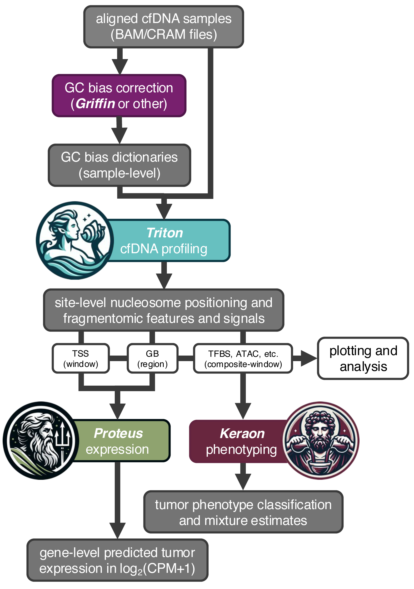
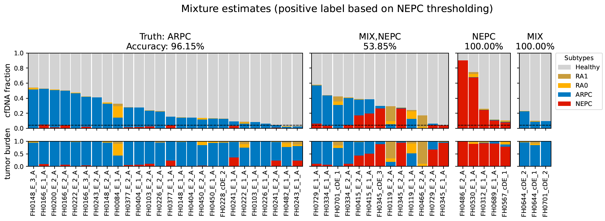

# Keraon 

As a tool for cancer subtype prediction, Keraon uses features derived from cell-free DNA (cfDNA) in conjunction
with PDX reference models to perform both classification and heterogeneous phenotype fraction estimation.

_Keraon_ (Ceraon) is named for the Greek god of the ritualistic mixing of wine.  
Like Keraon, this tool knows what went into the mix.
<br/><br/>

## The Pantheon

Keraon is part of **The Pantheon**, a suite of cfDNA processing and analysis tools. While each tool is useful independently, they are designed to work together:

| Tool | Purpose |
| ---- | ------- |
| [**Triton**](https://github.com/denniepatton/Triton) | cfDNA fragmentomic and phased-nucleosome feature extraction from BAM/CRAM files |
| [**Proteus**](https://github.com/denniepatton/Proteus) | Prediction of tumor gene expression from cfDNA signal profiles |
| [**Keraon**](https://github.com/denniepatton/Keraon) | Cancer subtype classification and mixture fraction estimation from cfDNA features |

Triton processes raw sequencing data into region-level features and signal profiles. Keraon then consumes Triton's tidy feature matrices to classify tumor subtypes and estimate their proportions. Proteus uses Triton signal profiles to predict underlying tumor gene expression.



---

## Table of Contents

- [Description](#description)
- [Quick Start](#quick-start)
- [Feature Recommendations](#feature-recommendations)
- [NEPC Detection Thresholds](#nepc-detection-thresholds)
- [Example Output](#example-output)
- [Usage](#usage)
  - [Inputs](#inputs)
  - [Workflow Flags](#workflow-flags)
  - [Optional Arguments](#optional-arguments)
- [Worked Examples](#worked-examples)
  - [Building a Reference Model with Pre-selected Features](#1-building-a-reference-model-with-pre-selected-features)
  - [Building a Reference Model with De Novo SVM Feature Selection](#2-building-a-reference-model-with-de-novo-svm-feature-selection)
  - [Running Inference with an Existing Basis](#3-running-inference-with-an-existing-basis)
  - [Running Inference with Calibration](#4-running-inference-with-calibration)
  - [Building and Using Your Own Basis](#5-building-and-using-your-own-basis)
- [Outputs](#outputs)
  - [Directory Structure](#directory-structure)
  - [ctdPheno Predictions](#ctdpheno-predictions-ctdpheno_class-predictionstsv)
  - [Keraon Mixture Predictions](#keraon-mixture-predictions-keraon_mixture-predictionstsv)
  - [Factor Loadings](#factor-loadings-factor_loadingstsv)
  - [Calibration Outputs](#calibration-outputs)
- [Methodology](#methodology)
  - [Pre-processing and Robust Scaling](#pre-processing-and-robust-scaling)
  - [Simplex Volume Maximization (SVM) Feature Selection](#simplex-volume-maximization-svm-for-feature-selection)
  - [Stability Selection for SVM Hyperparameters](#stability-selection-for-svm-hyperparameters)
  - [Classification (ctdPheno-GDA)](#classification-ctdpheno-gda)
  - [Mixture Estimation (Keraon)](#mixture-estimation-keraon)
- [Supplied Reference Bases](#supplied-reference-bases)
- [Requirements](#requirements)
- [Contained Scripts](#contained-scripts)
- [Publications](#publications)
- [Citing Keraon](#citing-keraon)
- [Contact](#contact)
- [Acknowledgments](#acknowledgments)
- [License](#license)

---

## Description

Keraon utilizes features derived from cfDNA WGS to perform cancer phenotype classification (**ctdPheno-GDA**) and heterogeneous/fractional phenotype mixture estimation (**Keraon**). To do this, Keraon uses a panel of healthy donor and PDX samples which span the subtypes of interest as anchors. Bioinformatically pure circulating tumor DNA (ctDNA) features garnered from the PDX models, in conjunction with matched features from healthy donor cfDNA, are used to construct a latent space on which purity-adjusted predictions are based. Keraon yields both categorical classification scores and mixture estimates, and includes a de novo feature selection option based on simplex volume maximization (SVM) which works synergistically with both methods.

Keraon's primary use case is subtyping late-stage cancers and detecting potential trans-differentiation events. See published results for classifying and estimating fractions of castration-resistant prostate cancer (CRPC) adenocarcinoma (ARPC) from neuroendocrine-like (NEPC) phenotypes.

**Note:** The example config files and supplied bases in `bases/` mirror the data described in the paper.

---

## Quick Start

```bash
# 1. Install environment
micromamba create -f keraon_requirements.yml && micromamba activate keraon

# 2. Run inference with the supplied PC-ATAC basis
python Keraon.py \
  -r bases/pc-atac_reference_model.pickle \
  -i /path/to/your/TritonCompositeFM.tsv \
  -t config/tfx_example.tsv \
  -p config/palette_example.tsv
```

---

## Feature Recommendations

Keraon supports any tidy feature matrix (columns: `sample`, `site`, `feature`, `value`), but two paradigms have been tested:

### 1. Phenotype-specific ATAC sites (recommended)

Composite, differentially open ATAC regions between phenotypes (e.g., ARPC-exclusive vs. NEPC-exclusive chromatin accessibility sites from the paper). The features `central-depth` and `window-depth` from Triton capture nucleosome-level occupancy differences at these sites and are the general recommendation. Use these with **pre-selected features** (`-f config/site_features_example.txt`) and the supplied `pc-atac` basis.

### 2. Transcription factor binding sites (TFBS)

TFBS regions from Triton can also be used for phenotyping when phenotype-specific ATAC sites are unavailable. De novo SVM feature selection (`--build_reference_model` without `-f`) selects the most discriminative TFBS site/feature combinations automatically. This approach is not fully production-tested but provides a good starting point. Use with the supplied `pc-tfbs` basis.

---

## NEPC Detection Thresholds

**Keraon is the primary output**; ctdPheno-GDA is essentially a legacy classifier provided for comparison. Internal testing shows better performance with Keraon on both standard-depth and ultra-low-pass (ULP) WGS, with lower resolution at ULP depths.

For calling the presence of NEPC using the supplied reference bases:

| Basis | Score column | Threshold | AUC | Notes |
| ----- | ------------ | --------- | --- | ----- |
| **PC-ATAC** | `NEPC_fraction` | **> 0.041** | 0.807 | Fewer false positives; recommended |
| **PC-TFBS** | `NEPC_fraction` | **> 0.047** | 0.845 | Higher AUC but more false positives |

A sample is called NEPC-positive when its `NEPC_fraction` exceeds the threshold.

---

## Example Output

The figure below shows Keraon mixture predictions on the UW clinical cohort (standard-depth WGS) using the supplied `pc-atac` basis. Each column is a patient sample sorted by TFX. Stacked bars show estimated subtype fractions (top: total cfDNA fractions including Healthy; bottom: tumor burden composition).



---

## Usage

### Inputs

| Flag | Description |
| ---- | ----------- |
| `-r, --reference_data` | **Required.** Either a single pre-built `reference_model.pickle` (preferred) **or** one or more tidy `.tsv` feature matrices (requires `-k`). |
| `-i, --input_data` | Tidy-form test feature matrix `.tsv` with columns `sample`, `site`, `feature`, `value`. |
| `-t, --tfx` | `.tsv` with test sample names and estimated tumor fractions. Optional third column `Truth` for calibration/validation. |
| `-k, --reference_key` | Reference key `.tsv` (required when building from `.tsv` files). Three columns: `sample`, `subtype`, `purity`. One subtype **must** be `Healthy` with `purity=0`. |

### Workflow Flags

| Flag | Description |
| ---- | ----------- |
| `--build_reference_model` | Build and save a `reference_model.pickle` from reference `.tsv` + key. |
| `--calibrate` | Requires `Truth` labels; computes Youden thresholds + QC cutoffs; writes to `results/calibration/`. |
| `--positive_label` | Specifies which `Truth` label is the positive class for ROC/calibration. |
| `--model_out` | Path to write the built model (default: `results/feature_analysis/reference_model.pickle`). |

### Optional Arguments

| Flag | Description |
| ---- | ----------- |
| `-f, --features` | File with pre-selected `site_feature` combinations (one per line) to bypass SVM feature selection. Format: `SiteName_feature-name` (underscores in site/feature names are converted to dashes internally). |
| `-p, --palette` | `.tsv` mapping subtypes to hex colors. Subtype names must match those in `-k` and `-t`. |

---

## Worked Examples

### 1. Building a Reference Model with Pre-selected Features

When you have known differentially accessible regions (e.g., phenotype-specific ATAC sites), pass them with `-f` to skip SVM feature selection:

```bash
python Keraon.py \
  -r /path/to/PDX_PC-ATAC_TritonCompositeFM.tsv \
     /path/to/HD_PC-ATAC_TritonCompositeFM.tsv \
  -k config/reference_key_example.tsv \
  -p config/palette_example.tsv \
  -f config/site_features_example.txt \
  --build_reference_model
```

This produces `results/feature_analysis/reference_model.pickle`. Copy it to `bases/` for reuse. The supplied `bases/pc-atac_reference_model.pickle` was generated this way.

### 2. Building a Reference Model with De Novo SVM Feature Selection

When using TFBS or other high-dimensional feature sets without a priori site selection, omit `-f` and let the SVM stability selection choose features automatically:

```bash
python Keraon.py \
  -r /path/to/PDX_TFBS_TritonCompositeFM.tsv \
     /path/to/HD_TFBS_TritonCompositeFM.tsv \
  -k config/reference_key_example.tsv \
  -p config/palette_example.tsv \
  --build_reference_model
```

The SVM evaluates a grid of hyperparameter combinations via bootstrapped stability selection (see [Methodology](#stability-selection-for-svm-hyperparameters)), selects stable features, and saves the frozen hyperparameters and feature frequencies. The supplied `bases/pc-tfbs_reference_model.pickle` was generated this way.

### 3. Running Inference with an Existing Basis

Once you have a `.pickle` basis, inference requires only test data:

```bash
python Keraon.py \
  -r bases/pc-atac_reference_model.pickle \
  -i /path/to/your/TritonCompositeFM.tsv \
  -t config/tfx_example.tsv \
  -p config/palette_example.tsv
```

If `Truth` labels are present in the TFX file (third column), ROC curves are automatically generated.

### 4. Running Inference with Calibration

Add `--calibrate` when `Truth` labels are available to compute optimal thresholds:

```bash
python Keraon.py \
  -r bases/pc-atac_reference_model.pickle \
  -i /path/to/your/TritonCompositeFM.tsv \
  -t config/tfx_example.tsv \
  -p config/palette_example.tsv \
  --calibrate
```

This saves a `reference_model.calibrated.pickle` with embedded thresholds, plus full calibration reports and plots in `results/calibration/`.

### 5. Building and Using Your Own Basis

To apply Keraon to a different cancer type or feature set:

1. **Prepare reference data:** Run Triton on your PDX/reference samples and healthy donors. Ensure the feature matrix is in tidy form (`sample`, `site`, `feature`, `value`).
2. **Prepare a reference key:** Create a `.tsv` with columns `sample`, `subtype`, `purity`. Include at least 3 samples per subtype, and one subtype must be `Healthy` (purity=0). PDX samples typically have purity=1.
3. **Build:** Run with `--build_reference_model` (and optionally `-f` with your pre-selected features).
4. **Infer:** Use the resulting `.pickle` with `-r` for all future inference runs.

---

## Outputs

### Directory Structure

```
results/
├── feature_analysis/
│   ├── reference_model.pickle                  # reusable ReferenceModel artifact
│   ├── reference_model.calibrated.pickle       # (optional) model with embedded thresholds
│   ├── stability_selection.tsv                 # per-feature bootstrap selection frequencies (SVM only)
│   ├── svm_hyperparams_frozen.json             # frozen SVM objective hyperparameters (SVM only)
│   ├── PCA_final-basis_wTestSamples.pdf        # PCA of final feature set with test samples projected
│   ├── inference_plots/                        # ROC and score distribution plots (if Truth provided)
│   └── feature_distributions/
│       ├── reference_features/                 # per-feature distribution PDFs (reference, post-scaling)
│       ├── test_features/                      # per-feature distribution PDFs (test, post-scaling)
│       └── final-basis_site-features/          # per-feature PDFs for reference + test overlay
│
├── ctdPheno_class-predictions/
│   ├── ctdPheno_class-predictions.tsv          # NLL-based scoring and posterior class predictions
│   ├── ROC.pdf                                 # (optional) ROC curve if Truth provided
│   └── <subtype>_predictions.pdf               # per-subtype stick-and-ball visualization
│
├── keraon_mixture-predictions/
│   ├── Keraon_mixture-predictions.tsv          # subtype fractions, burdens, and QC metrics
│   ├── factor_loadings.tsv                     # basis vectors (V) and off-target axes (U) per feature
│   ├── ROC_fraction.pdf                        # (optional) ROC curve if Truth provided
│   └── Keraon_mixture-predictions.pdf          # stacked-bar visualization of fractions/burdens
│
└── calibration/                                # (only with --calibrate)
    ├── calibration_predictions.tsv             # merged predictions with Truth
    ├── calibration_thresholds.json             # Youden thresholds + bootstrap CIs
    ├── calibration_report.tsv                  # summary statistics
    └── calibration_plots/                      # ROC + score distribution plots
```

### ctdPheno Predictions (`ctdPheno_class-predictions.tsv`)

| Column | Description |
| ------ | ----------- |
| `TFX` | Provided tumor fraction for this sample |
| `logp_<subtype>` | Log-likelihood of the sample under the TFX-shifted mixture distribution for each subtype |
| `post_<subtype>` | Posterior probability of each subtype (softmax over log-likelihoods with class priors) |
| `predicted_class` | Subtype with the highest posterior probability |

**Interpretation:** `post_NEPC` close to 1.0 means the sample's feature profile, accounting for its tumor fraction, is most consistent with the NEPC reference. The posterior values across subtypes sum to 1.0 for each sample.

### Keraon Mixture Predictions (`Keraon_mixture-predictions.tsv`)

| Column | Description |
| ------ | ----------- |
| `TFX` | Provided tumor fraction |
| `<subtype>_burden` | Estimated fraction of the tumor signal attributable to this subtype. All burdens (subtype + RA) sum to 1.0. |
| `<subtype>_fraction` | `TFX × <subtype>_burden` — the fraction of total cfDNA from this subtype |
| `Healthy_fraction` | `1 − TFX` — the cfDNA fraction from healthy cells |
| `RA<i>_coeff` | Signed projection coefficient onto residual axis *i* (off-target variation) |
| `RA<i>_energy` | Squared magnitude of the RA*i* component |
| `RA<i>_burden` | Fraction of tumor burden from off-target axis *i* |
| `RA<i>_fraction` | `TFX × RA<i>_burden` |
| `energy_subspace` | Squared norm of the sample's projection into the subtype span |
| `energy_offtarget` | Squared norm of the off-target (RA) component |
| `energy_residual_perp` | Squared norm of the unexplained residual (orthogonal to both subtype and RA subspaces) |
| `residual_perp_fraction` | `energy_residual_perp / (energy_subspace + energy_offtarget + energy_residual_perp)` — fraction of total signal unexplained by the model. High values suggest the sample does not conform to the reference subtypes. |
| `subtype_cone_misfit` | NNLS reconstruction error normalized by subspace energy. Values near 0 mean the sample lies within the simplex cone; higher values indicate the sample direction is not well-described by the reference subtype directions. |
| `FS_Region` | `Simplex` if NNLS coefficients sum to ≤ 1 (sample inside the simplex), else `Non-Simplex`. |

**Interpretation:** For each sample, all `*_fraction` columns (disease subtypes + RA axes + Healthy) sum to 1.0. The `*_burden` columns describe only the tumor compartment and also sum to 1.0. A sample with `NEPC_fraction = 0.10` and `TFX = 0.20` has 50% of its tumor burden explained by the NEPC direction (`NEPC_burden = 0.50`).

### Factor Loadings (`factor_loadings.tsv`)

Each row is a feature (e.g., `AR_central-depth`); each column is a subtype direction or residual axis. Values are the components of the unit-length basis vectors **V** (disease subtypes) and **U** (RA off-target axes) in the original feature space. Features with large absolute loadings on a given axis contribute most to that axis's signal. This is analogous to PCA loadings and can be used to interpret which features drive each subtype's signature.

### Calibration Outputs

When `--calibrate` is used with `Truth` labels, Keraon computes Youden-optimal thresholds via bootstrap (500 resamples). The `calibration_thresholds.json` contains the median threshold, 95% CI, and associated Youden J statistic for both ctdPheno and Keraon scores.

---

## Methodology

### Pre-processing and Robust Scaling

The raw tidy feature matrix undergoes a multi-stage transformation implemented in `load_triton_fm()`:

1. **Optional point transforms** — per-feature monotone transforms (e.g., `log(1 + max(x, 0))` for entropy and amplitude features) are applied to improve normality before any centering/scaling.

2. **Feature-wise standardization** — for each (site, feature) pair across the reference samples:

$$\tilde{x}\_{s,f} \;=\; \frac{x\_{s,f} \;-\; \mu\_f}{\sigma\_f + \varepsilon}$$

where $\mu\_f$ is the reference mean, $\sigma\_f$ is the reference standard deviation, and $\varepsilon = 10^{-8}$. Standardization parameters are stored in the `reference_model.pickle` and applied identically to test data.

3. **Pivoting** — the tidy-form data is pivoted to a (samples × features) matrix where each column is `site_feature`.

---

### Simplex Volume Maximization (SVM) for Feature Selection

When no pre-selected features are provided (`-f` omitted), Keraon performs de novo feature selection by choosing a subset of features that maximizes the geometric separation of subtype centroids in the feature space.

#### Objective Function

For a candidate feature mask $\alpha$ (a Boolean vector over $d$ features), the objective combines five terms evaluated in a whitened feature space:

$$\text{Obj}(\alpha) \;=\; \exp\!\Big(\underbrace{\log V}\_{\text{volume}} \;+\; \underbrace{\alpha\_M \log(e\_{\min} + \varepsilon) \;+\; \beta\_E \log(\bar{H} + \varepsilon)}\_{\text{edge terms}} \;+\; \underbrace{-\gamma\_S \log(\bar{s} + \varepsilon)}\_{\text{scatter penalty}} \;+\; \underbrace{-\gamma\_R \, \bar{\rho}}\_{\text{redundancy}} \;+\; \underbrace{-\lambda\_{L0} \, |\alpha|}\_{\text{count penalty}}\Big)$$

where:

| Symbol | Definition |
| ------ | ---------- |
| $\log V$ | Log-volume of the $k$-simplex formed by class centroids in the masked, whitened space (via log-determinant of the Gram matrix): $\log V = \tfrac{1}{2} \log\det(G) - \log(k!)$ |
| $e\_{\min}$ | Minimum pairwise Euclidean distance between centroids (margin term) |
| $\bar{H}$ | Harmonic mean of all pairwise centroid distances (global edge regularity) |
| $\bar{s}$ | Mean within-class scatter (root-sum of diagonal variances, whitened) |
| $\bar{\rho}$ | Mean absolute off-diagonal correlation among selected features |
| $|\alpha|$ | Number of selected features |
| $\alpha\_M, \beta\_E, \gamma\_S, \gamma\_R, \lambda\_{L0}$ | Tunable hyperparameters (see Stability Selection below) |

The whitening matrix $\boldsymbol{W} = \boldsymbol{\Sigma}^{-1/2}$ is computed from the global reference covariance with Ledoit-Wolf-style shrinkage ($\lambda = 0.02$) and eigenvalue flooring ($\varepsilon = 10^{-8}$).

#### Greedy Algorithm

1. **Seed** — select one feature per non-Healthy subtype based on the highest combined Cohen's $d$ × separation score (Mann-Whitney *U* tie-breaking).
2. **Prune** — if the initial set exceeds $k = |\text{subtypes}| - 1$ features, iteratively remove the feature whose removal least reduces the objective until exactly $k$ remain.
3. **Refine** — for each selected feature, scan all unselected features for a replacement that improves the objective. Repeat until no improving swap exists.
4. **Grow** — greedily add the single unselected feature yielding the largest objective increase. Stop when relative gain $< 0.1\%$, or when the hard feature cap is reached (default: $\max(5 \times |\text{subtypes}|,\, 50)$).

---

### Stability Selection for SVM Hyperparameters

To avoid overfitting the hyperparameters $(\lambda\_{L0},\, \gamma\_S,\, \alpha\_M,\, \beta\_E,\, \gamma\_R)$ to a single feature-selection run, Keraon performs **stability selection** (Meinshausen & Buhlmann, 2010):

1. For each combination in the hyperparameter grid (default: $2^5 = 32$ combinations):
   - Draw $B = 100$ stratified bootstrap resamples of the reference data (80% subsample rate per subtype).
   - Run the full SVM greedy algorithm on each bootstrap.
   - Record which features were selected in each bootstrap.
2. Compute the **selection frequency** $\hat{\pi}\_f$ for each feature (fraction of bootstraps that selected it).
3. Compute **mean pairwise Jaccard stability** across bootstrap replicates.
4. Features with $\hat{\pi}\_f > \theta$ (default $\theta = 0.10$) form the stable set.
5. The hyperparameter combination with the highest stability, tie-broken by full-data SVM objective and then by smallest feature set, is chosen.

The winning hyperparameters, selection frequencies, and stable feature list are frozen into the `reference_model.pickle`. Bootstrap resamples are parallelized across CPU cores.

---

### Classification (ctdPheno-GDA)

ctdPheno-GDA performs purity-adjusted Gaussian discriminant analysis in a whitened feature space. (**Note:** Keraon mixture estimation is now the recommended primary output; ctdPheno is retained for compatibility and as a complementary categorical classifier.)

#### Whitening

The global reference covariance $\boldsymbol{\Sigma}$ is computed and regularized:

$$\boldsymbol{\Sigma}' = (1 - \lambda)\,\boldsymbol{\Sigma} + \lambda\,\mathbf{I}, \qquad \boldsymbol{W} = (\boldsymbol{\Sigma}')^{-1/2}$$

All class means $\boldsymbol{\mu}\_c$ and covariances $\boldsymbol{\Sigma}\_c$ are transformed into the whitened space: $\boldsymbol{\mu}^w\_c = \boldsymbol{W}(\boldsymbol{\mu}\_c - \bar{\boldsymbol{x}})$, $\boldsymbol{\Sigma}^w\_c = \boldsymbol{W}\,\boldsymbol{\Sigma}\_c\,\boldsymbol{W}^\top$.

#### Purity-adjusted Mixture Model

For a test sample $\mathbf{y}$ (whitened) with tumor fraction $t$, the TFX-shifted mixture parameters for each class $c$ are:

$$\boldsymbol{\mu}\_{\text{mix}} = (1 - t)\,\boldsymbol{\mu}^w\_{\text{Healthy}} + t\,\boldsymbol{\mu}^w\_c$$

$$\boldsymbol{\Sigma}\_{\text{mix}} = (1 - t)^2\,\boldsymbol{\Sigma}^w\_{\text{Healthy}} + t^2\,\boldsymbol{\Sigma}^w\_c$$

The covariance uses squared weights because the healthy and tumor components are treated as independent random variables contributing to the observed cfDNA signal.

#### Log-Likelihood and Posterior

The log-likelihood under a multivariate normal is:

$$\log p(\mathbf{y} \mid c, t) = -\frac{1}{2}\Big[(\mathbf{y} - \boldsymbol{\mu}\_{\text{mix}})^\top \boldsymbol{\Sigma}\_{\text{mix}}^{-1} (\mathbf{y} - \boldsymbol{\mu}\_{\text{mix}}) + \log|\boldsymbol{\Sigma}\_{\text{mix}}| + d\log(2\pi)\Big]$$

The posterior probability of class $c$ is:

$$P(c \mid \mathbf{y}, t) = \frac{\pi\_c \cdot p(\mathbf{y} \mid c, t)}{\sum\_{c'} \pi\_{c'} \cdot p(\mathbf{y} \mid c', t)}$$

where $\pi\_c$ is the class prior (proportion in the reference). The predicted class is $\arg\max\_c P(c \mid \mathbf{y}, t)$.

---

### Mixture Estimation (Keraon)

Keraon performs a geometric decomposition of each test sample's feature vector into subtype, off-target, and residual components.

#### Subtype Basis Construction

1. **Subtype mean vectors:** For each subtype $i$, compute the mean feature vector $\boldsymbol{\mu}\_i$ across reference samples.

2. **Directional vectors:** Subtract the Healthy centroid to obtain disease directions:

$$\mathbf{v}\_i = \frac{\boldsymbol{\mu}\_i - \boldsymbol{\mu}\_{\text{Healthy}}}{\|\boldsymbol{\mu}\_i - \boldsymbol{\mu}\_{\text{Healthy}}\| + \varepsilon}$$

3. **Orthonormal basis via QR:** Stack the $\mathbf{v}\_i$ as columns of $\mathbf{V}$ and compute $\mathbf{V} = \mathbf{Q}\mathbf{R}$. The orthonormal columns $\mathbf{Q}\_V$ span the subtype subspace. The projection matrices are:

$$\mathbf{P} = \mathbf{Q}\_V \mathbf{Q}\_V^\top, \qquad \mathbf{P}\_{\perp} = \mathbf{I} - \mathbf{P}$$

#### Off-Target (Residual Axis) Basis

Reference samples are centered by $\boldsymbol{\mu}\_{\text{Healthy}}$ and projected into the orthogonal complement $\mathbf{P}\_{\perp}$. SVD on these residuals yields the top $k$ directions of maximum variance in the complement space (default $k = 3$, labeled RA0, RA1, RA2). These capture biological or technical variation orthogonal to the modeled subtypes.

#### Sample Decomposition

For a test sample $\mathbf{x}$ with tumor fraction $t$:

1. **Center:** $\mathbf{z} = \mathbf{x} - \boldsymbol{\mu}\_{\text{Healthy}}$
2. **Subtype projection:** $\mathbf{z}\_{\parallel} = \mathbf{P}\,\mathbf{z}$, with energy $E\_S = \|\mathbf{z}\_{\parallel}\|^2$
3. **Off-target projection:** $\mathbf{z}\_{\text{off}} = \mathbf{U}\,(\mathbf{U}^\top \mathbf{P}\_{\perp}\mathbf{z})$, with energy $E\_O = \|\mathbf{z}\_{\text{off}}\|^2$
4. **Residual:** $\mathbf{z}\_{\text{res}} = \mathbf{P}\_{\perp}\mathbf{z} - \mathbf{z}\_{\text{off}}$, with energy $E\_R = \|\mathbf{z}\_{\text{res}}\|^2$

Energy decomposes exactly: $\|\mathbf{z}\|^2 = E\_S + E\_O + E\_R$.

#### Burden and Fraction Computation

1. **Modeled energy:** $E\_M = E\_S + E\_O$
2. **Subtype burden:** $b\_S = E\_S / E\_M$, **off-target burden:** $b\_O = E\_O / E\_M$
3. **Subtype partitioning via NNLS:** Solve $\min\_{\mathbf{c} \geq 0} \|\mathbf{V}\mathbf{c} - \mathbf{z}\_{\parallel}\|^2$. The NNLS coefficients $\mathbf{c}$ are re-weighted by the Gram matrix $\mathbf{G} = \mathbf{V}^\top\mathbf{V}$ to produce Gram-weighted subtype burdens that sum to $b\_S$.
4. **Normalization:** All burdens (subtype + RA) are normalized to sum to exactly 1.0.
5. **Fractions:** Each burden is scaled by $t$ (tumor fraction) to get the cfDNA fraction: $f\_i = t \cdot b\_i$. Healthy fraction is $1 - t$. All fractions sum to 1.0.

---

## Supplied Reference Bases

The `bases/` directory contains two pre-built reference models that can be used directly for ARPC vs. NEPC phenotyping:

| File | Features | Sites | Description |
| ---- | -------- | ----- | ----------- |
| `pc-atac_reference_model.pickle` | `central-depth`, `window-depth` | AD-Exclusive, NE-Exclusive composite ATAC sites | Pre-selected phenotype-specific features; matches the paper |
| `pc-tfbs_reference_model.pickle` | SVM-selected | Transcription factor binding sites | De novo feature selection from TFBS features |

Both were built using the same LuCaP PDX + Healthy Donor reference panel described in the paper (21 ARPC, 8 NEPC, 20 Healthy; see `config/reference_key_example.tsv`).

---

## Requirements

Keraon uses standard scientific Python libraries and has been tested on Python 3.10-3.11. To create a tested environment:

```bash
# Install Micromamba (if not already installed):
# https://mamba.readthedocs.io/en/latest/installation/micromamba-installation.html

# Create and activate the environment:
micromamba create -f keraon_requirements.yml
micromamba activate keraon

# Verify:
micromamba list
```

Key dependencies: NumPy, Pandas, SciPy, scikit-learn, Matplotlib, Seaborn.

---

## Contained Scripts

| Script | Description |
| ------ | ----------- |
| `Keraon.py` | Primary entry point for model building, inference, and calibration |
| `utils/keraon_utils.py` | Data loading, scaling, pivoting, and palette management |
| `utils/keraon_helpers.py` | SVM feature selection, simplex geometry, and stability selection |
| `utils/keraon_model.py` | Keraon mixture model fitting (basis construction) and prediction (decomposition) |
| `utils/ctdpheno_gda.py` | ctdPheno-GDA classifier (whitened Gaussian discriminant analysis) |
| `utils/whitening.py` | Covariance regularization and matrix square-root utilities |
| `utils/reference_builder.py` | Orchestrates model building (feature selection → model fitting → serialization) |
| `utils/reference_model.py` | `ReferenceModel` dataclass, pickle I/O, and TSV/JSON writers |
| `utils/calibration.py` | Youden threshold computation and bootstrap calibration |
| `utils/calibration_plots.py` | ROC and score distribution plotting |
| `utils/keraon_plotters.py` | PCA, ctdPheno stick-and-ball, Keraon stacked-bar, and feature distribution plots |

---

## Publications

[Nucleosome Patterns in Circulating Tumor DNA Reveal Transcriptional Regulation of Advanced Prostate Cancer Phenotypes](https://doi.org/10.1158/2159-8290.CD-22-0692)  
DOI: [10.1158/2159-8290.CD-22-0692](https://doi.org/10.1158/2159-8290.CD-22-0692)

---

## Citing Keraon

If you use Keraon in your research, please cite:

> "Nucleosome Patterns in Circulating Tumor DNA Reveal Transcriptional Regulation of Advanced Prostate Cancer Phenotypes." _Cancer Discovery_ **13**(10), 2304–2325 (2023). https://doi.org/10.1158/2159-8290.CD-22-0692

## Contact

If you have any questions or feedback, please contact me here on GitHub or at:  
**Email:** <rpatton@fredhutch.org>

## Acknowledgments

Keraon is developed and maintained by Robert D. Patton in the Gavin Ha Lab, Fred Hutchinson Cancer Center.

## License

The MIT License (MIT)

Copyright (c) 2022 Fred Hutchinson Cancer Center

Permission is hereby granted, free of charge, to any government or not-for-profit entity, or to any person employed at one of the foregoing (each, an "Academic Licensee") who obtains a copy of this software and associated documentation files (the "Software"), to deal in the Software purely for non-commercial research and educational purposes, including the rights to use, copy, modify, merge, publish, distribute, sublicense, and/or share copies of the Software, and to permit other Academic Licensees to whom the Software is furnished to do so, subject to the following conditions:

The above copyright notice and this permission notice shall be included in all copies or substantial portions of the Software.

No Academic Licensee shall be permitted to sell or use the Software or derivatives thereof in any service for commercial benefit. For the avoidance of doubt, any use by or transfer to a commercial entity shall be considered a commercial use and will require a separate license with Fred Hutchinson Cancer Center.

THE SOFTWARE IS PROVIDED "AS IS", WITHOUT WARRANTY OF ANY KIND, EXPRESS OR IMPLIED, INCLUDING BUT NOT LIMITED TO THE WARRANTIES OF MERCHANTABILITY, FITNESS FOR A PARTICULAR PURPOSE AND NONINFRINGEMENT. IN NO EVENT SHALL THE AUTHORS OR COPYRIGHT HOLDERS BE LIABLE FOR ANY CLAIM, DAMAGES OR OTHER LIABILITY, WHETHER IN AN ACTION OF CONTRACT, TORT OR OTHERWISE, ARISING FROM, OUT OF OR IN CONNECTION WITH THE SOFTWARE OR THE USE OR OTHER DEALINGS IN THE SOFTWARE.
